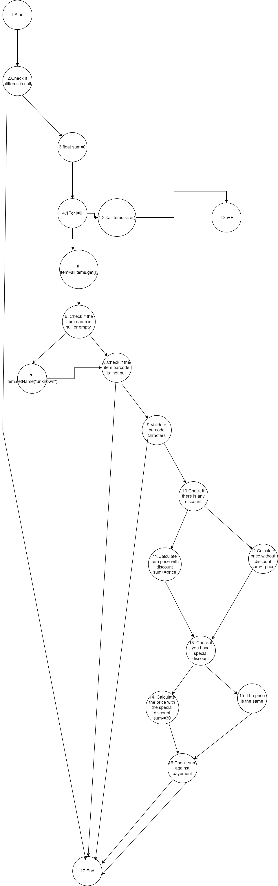

Јана Стоичкова 223112 
# 2.Control Flow Graph

# 3.Цикломатска комплексност
Цикломатската комплексност за дадениот код се пресметува со следната формула:
Цикломатска комплексност=E−N+2P
Е(Рабови)=25
N(Јазли)=19
Р(Број на поврзани компоненти)=1
E−N+2P=25-19+2*1=8
# 4.Every Branch критериум
Со овој критериум треба да направиме тест случаи што ќе ја поминат секоја гранка односно секој if.Ние имаме вкупно 7 гранки, и за нив тест случаите би биле:

1.if (allItems == null)
За оваа гранка имаме 2 можни случаи во кои би бил точен if-от и тоа се кога:-allItems = null или -allItems да биде празна листа

2.if (item.getName() == null || item.getName().length() == 0)
Исто така и за оваа гранка имаме 2 случаи:
 -item.getName() = null - би бил исполнет ако името на предметот е null, односно ако предметот изгледа вака: (null, "43525", 50, 0.10)
-item.getName().length() = 0 - би бил исполнет ако името на предметот е празно, тоа би изгледа вака: ("", "43525", 50, 0.10)

3.if (item.getBarcode() != null)
Тука имаме само еден  случај за да биде точно, а тоа е item.getBarcode() = null.

4.if (allowed.indexOf(c) == -1)
За оваа гранка потребно е item.getBarcode да содржи невалиден карактер, односно било кој карактер што не е цифра. Една можна вредност е "а123456"

5.if (item.getDiscount() > 0)
Тука потребно еitem.discount  да биде поголемо од 0, например 0.15 што ни означува 15% попуст на тој производ.

6.if (item.getPrice() > 300 && item.getDiscount() > 0 && item.getBarcode().charAt(0) == '0')
За оваа гранка треба да бидат исполнети 3 услови, и тоа:
    -item.getPrice() > 300 - цената на продуктот да биде поголема од 300
    -item.getDiscount() > 0 -  да имаме попуст на тој продукт
    -item.getBarcode().charAt(0) == '0' - баркодот на продуктот да почнува на 0
Еден пример за таков продукт е ("Jabolki", "0212346", 315, 0.45)

7.if (sum <= payment)

Кај оваа гранка потребно е сумата од цените на сите прозводи да биде помала или еднаква со уплатените средства. Може да внесеме ("Jabolki", "0212346", 315, 0.45), ("Sok", "3456272", 70, 0), ("Salama", "2341682", 250, 0.5) како продукти и 2590 како payment.
# 5.Multiple condition критериум
Условот if (item.getPrice() > 300 && item.getDiscount() > 0 && item.getBarcode().charAt(0)== '0') има 3 под услови и тоа се:
1.A=item.getPrice() > 300
2.B=item.getDiscount() > 0
3.C=item.getBarcode().charAt(0) == '0'
Според Multiple Condition критериумот ние треба да ги тестираме сите можни комбинации на овие три под услови.
Тест случаи:
1. Сите 3 под услови да се True еден таков пример ни е ("Jabolki", "0212346", 315, 0.45).Бидејќи сите три подуслови ни се исполнети специјалниот попуст ќе биде додаден на цената.

2.A = True, B = True, C = False еден пример за ваков случај е  ("Jabolki", "1212346", 315, 0.45).Во овој случај големиот услов нема да ни се исполни и попустот нема да биде пресметан.

3.A = True, B = False, C = True  еден пример за ваков случај е  ("Jabolki", "0212346", 315, 0).Во овој случај големиот услов нема да ни се исполни и попустот нема да биде пресметан.

4.A = True, B = False, C = False еден пример за ваков случај е  ("Jabolki", "1212346", 315, 0).Во овој случај големиот услов нема да ни се исполни и попустот нема да биде пресметан.

5.A = False, B = True, C = True еден пример за ваков случај е  ("Jabolki", "0212346", 150, 0.15).Во овој случај големиот услов нема да ни се исполни и попустот нема да биде пресметан.

6.A = False, B = True, C = False еден пример за ваков случај е  ("Jabolki", "1212346", 150, 0.15).Во овој случај големиот услов нема да ни се исполни и попустот нема да биде пресметан.

7.A = False, B = False, C = True еден пример за ваков случај е  ("Jabolki", "0212346", 150, 0).Во овој случај големиот услов нема да ни се исполни и попустот нема да биде пресметан.

8.A = False, B = False, C = False еден пример за ваков случај е  ("Jabolki", "1212346", 150, 0).Во овој случај големиот услов нема да ни се исполни и попустот нема да биде пресметан.
